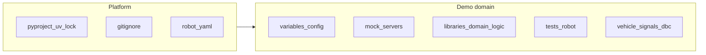

# Map: convention vs customization

Quick mental model for interviews and maintenance:

- **Platform / convention**: follow uv, PEP 621, Robot, Flask, paho docs—you do not owe a line-by-line defense.
- **Contract / domain**: MQTT topics, REST routes, CAN/DBC signals, test scenarios—where engineering judgment shows.
- **Mixed**: same file—part idiomatic boilerplate, part your design.

---

## Mostly platform / convention

| File | Why |
|------|-----|
| [`uv.lock`](../uv.lock) | Generated by `uv`; do not hand-edit; purpose is reproducible installs. |
| [`.gitignore`](../.gitignore) | Common Python template + Robot outputs (`report.html`, `output.xml`, `results/`) + `.venv`; explicit choices mainly in the final “Project specific” block. |
| [`pyproject.toml`](../pyproject.toml) | **PEP 621**: `[project]`, `dependencies`, `optional-dependencies`. **`[build-system]`**: PEP 517 default. **`[tool.black]` / `[tool.mypy]`**: typical team/IDE settings. **`[tool.setuptools.packages.find]`**: packaging layout (`libraries*`, `variables*`), not automotive domain. Interview line: “I declare ranges and extras here; the lockfile pins exact versions.” |

---

## Mostly customized / demo contract

| File | Why |
|------|-----|
| [`variables/config.py`](../variables/config.py) | URLs, ports, thresholds, DBC path—**single configuration surface** for “swap by config”. |
| [`mock_servers/ecu_rest_server.py`](../mock_servers/ecu_rest_server.py) | `/api/...` routes, JSON shape, in-memory state—**shared contract** with the REST client library. |
| [`tests/network_stack.robot`](../tests/network_stack.robot), [`tests/bonus/*.robot`](../tests/bonus/) | Scenarios, tags, process setup—**test narrative**. |
| [`resources/mqtt_keywords.resource`](../resources/mqtt_keywords.resource), [`rest_ecu_keywords.resource`](../resources/rest_ecu_keywords.resource), [`vehicle_keywords.resource`](../resources/vehicle_keywords.resource) | Keyword names and composition—**Robot “business” layer** vs Python. Syntax (`*** Settings ***`, `*** Keywords ***`) is Robot; **content** is yours. |
| [`resources/vehicle_signals.dbc`](../resources/vehicle_signals.dbc) | Messages/signals—**automotive domain**. |
| [`examples.py`](../examples.py) | How you exercise the libs—custom. |
| [`README.md`](../README.md), [`QUICKSTART.md`](../QUICKSTART.md), [`TECHNICAL_DOCUMENTATION.md`](../TECHNICAL_DOCUMENTATION.md) | Human-facing narrative—custom (Markdown structure is universal). |
| [`docs/archive/*`](archive/) | Archived extras—low priority to explain line-by-line. |

---

## Mixed files (same file: “that’s just how it works” vs “your design”)

### [`libraries/mqtt_vehicle_network.py`](../libraries/mqtt_vehicle_network.py)

- **Convention**: `logging.getLogger(__name__)`, optional `ImportError` guard, `@library(...)`, `mqtt.CallbackAPIVersion.VERSION2`, connect/subscribe/publish flow per paho docs.
- **Customization**: `TOPICS` mapping (`vehicle/sensors/...`), exposed keywords, JSON payloads.

### [`libraries/rest_ecu_api.py`](../libraries/rest_ecu_api.py)

- **Convention**: `requests.Session`, `urllib3.Retry` + `HTTPAdapter`—resilient HTTP client pattern from `requests` docs.
- **Customization**: `ENDPOINTS`, `get_ecu_signal` naming, default `base_url`—**contract with** [`mock_servers/ecu_rest_server.py`](../mock_servers/ecu_rest_server.py).

### [`libraries/automotive_lib.py`](../libraries/automotive_lib.py)

- **Convention**: `@library`, logging, `@dataclass`, `cantools` / `python-can` as documented.
- **Customization**: `AdbMock` properties/commands, `CanBusManager` and `send_signal` (full-frame fill), [`DBC_PATH`](../variables/config.py) integration.

### [`libraries/automotive_listener.py`](../libraries/automotive_listener.py)

- **Convention**: `ROBOT_LISTENER_API_VERSION = 2`, `start_suite` / `end_test` / …—**Robot listener API**.
- **Customization**: counters (`signal_count`, `api_call_count`, …), `logs/` output, JSON metric shape—**your observability story**.

### [`mock_servers/mqtt_broker_helper.py`](../mock_servers/mqtt_broker_helper.py)

- **Convention**: `amqtt.broker.Broker`, asyncio, signal handling—embedded broker script pattern.
- **Customization**: logging messages, CLI surface (if any)—demo policy.

### [`setup_project.py`](../setup_project.py)

- **Convention**: `logging.basicConfig`, `sys.version_info`, dynamic imports for dependency checks.
- **Customization**: `required_files` / directories—**your definition of “minimum viable project”.**

### [`quickstart.py`](../quickstart.py)

- **Convention**: `subprocess.run`, `Path(__file__).parent`.
- **Customization**: commands you wrap. For wiping `results/`, `logs/`, `.robocache/`, use a one-off shell command (e.g. `Remove-Item` in PowerShell) instead of duplicating shortcuts in `.bat` and `Makefile`.

Robot settings use `Variables    variables.config` (same idea as `import variables.config`): requires `--pythonpath .` or editable install so the `variables` package resolves.

### [`robot.yaml`](../robot.yaml)

- **Convention**: Robot config format (`*** Settings ***`), standard libraries (`Process`, `String`, …), `Test Timeout`, `Suite Concurrency`.
- **Customization**: values (e.g. 60s, concurrency 1) and which libs you preload.

### [`libraries/__init__.py`](../libraries/__init__.py)

- **Convention**: `__all__`, `__version__`, re-exports—normal Python package.
- **Customization**: **which** symbols you expose as public API.

### [`variables/__init__.py`](../variables/__init__.py)

- Negligible for interviews (short docstring only).

---

## Intra-file patterns you can label “Python/Robot idiom” (no deep story)

- `logger = logging.getLogger(__name__)`
- `from robot.api.deco import library` + `@library(...)` (Robot Framework 7 style libraries)
- `ROBOT_LISTENER_API_VERSION` (listener API requirement—one sentence is enough)
- Flask: `Flask(__name__)`, `CORS(app)`, `@app.get`
- Long docstrings in libs—oral shortcut: “the keyword layer documents intent.”

---

## Not “your code” in an interview sense

- Contents of `.venv`, `*.egg-info`, `site-packages`—install artifacts and dependencies.

---

## One-liner: integration contract

**Central configuration lives in `variables/config.py`; the mock ECU defines REST routes and JSON shapes; Robot resources map readable keywords onto those contracts—so endpoints and brokers can change via config without rewriting scenarios.**

---

## Interview phrase (professional tone)

“The dependency and packaging layers follow standard Python and uv practice; where I invested judgment is the contract between the mock ECU, the MQTT topics, and the Robot keywords—so we can change endpoints or brokers via config without rewriting scenarios.”

---

## Pre-call skim notes (mixed files)

Use this checklist before a technical discussion; focus answers on **custom** rows.

### `mqtt_vehicle_network.py`

| Remember | Type |
|----------|------|
| `TOPICS` keys → MQTT strings under `vehicle/...` | **Custom** (contract with tests/publishers) |
| `@library`, optional deps, paho `VERSION2`, loop/thread | **Convention** |

### `rest_ecu_api.py`

| Remember | Type |
|----------|------|
| `ENDPOINTS` paths ↔ [`ecu_rest_server.py`](../mock_servers/ecu_rest_server.py) | **Custom** |
| `Retry`, `HTTPAdapter`, `Session` | **Convention** |

### `automotive_listener.py`

| Remember | Type |
|----------|------|
| `ROBOT_LISTENER_API_VERSION`, hook method names/signatures | **Convention** (Robot API) |
| `signal_count`, `api_call_count`, suite/test metrics, `_save_metrics`, `output_dir` | **Custom** |
